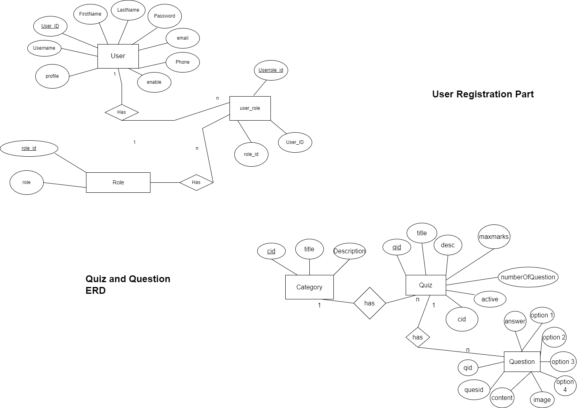

# Exam-portal-Spring-boot-Angular
The Exam Portal is a comprehensive web application designed to streamline and simplify the process of managing exams. It consists of a dynamic front-end developed using Angular and a robust back-end powered by Spring Boot.

<h2>DB design ER Diagram</h2>

